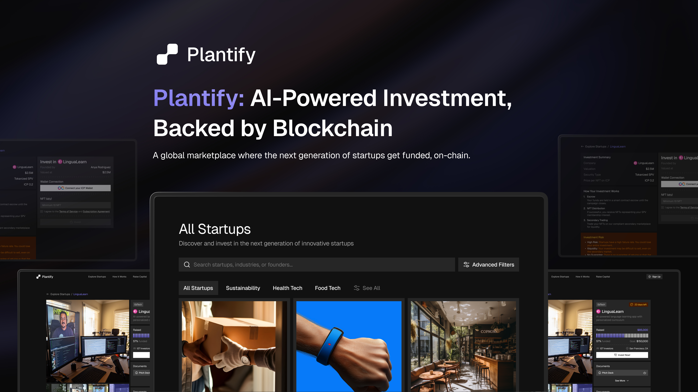
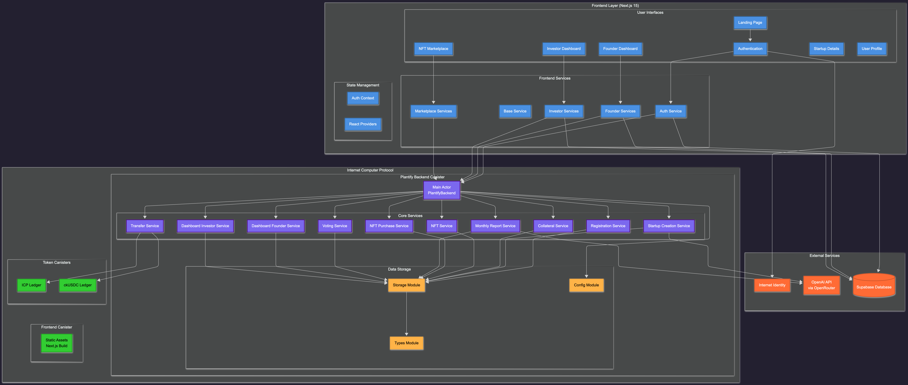
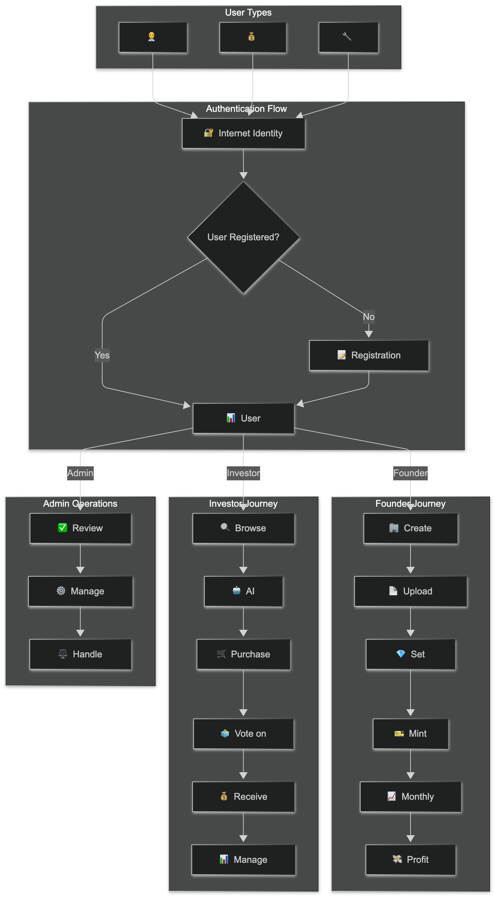
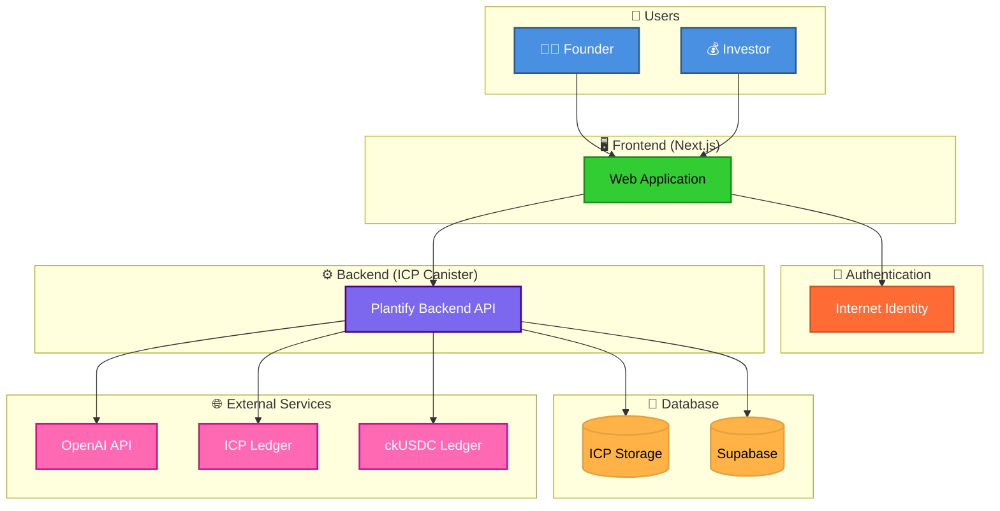

# 🌱 Plantify

<div align="center">
  
  
  
  ### 🚀 The AI-Powered Investment Platform for Sustainable Startups
  
  [](https://ueifo-jqaaa-aaaah-qqewa-cai.icp0.io/)
  [](https://dashboard.internetcomputer.org/canister/oncwy-yqaaa-aaaae-qfzja-cai)
  [](docs/Architecture-Diagram.md)
  
  **Plantify connects investors with sustainable startups through AI-powered analysis, intelligent matching, and automated investment processes on the Internet Computer blockchain.**
  
</div>

---

## 🎯 What is Plantify?

<table>
<tr>
<td width="50%">

### 🌿 **For Sustainable Future**
Plantify is revolutionizing how we invest in sustainable startups. Built entirely on-chain using Internet Computer Protocol, we provide a transparent, secure, and intelligent platform for green investments.

### 🤖 **AI-Powered Intelligence**
Our advanced AI analyzes startup sustainability profiles, generates professional investment reports, and suggests optimal investment strategies in real-time.

### 🔗 **Blockchain Security**
Every transaction, vote, and profit distribution is secured by blockchain technology, ensuring complete transparency and trust.

</td>
<td width="50%">



</td>
</tr>
</table>

---

## ✨ Key Features

<div align="center">

| 👨‍💼 **For Founders** | 💰 **For Investors** | 🤖 **AI Features** |
|:---:|:---:|:---:|
| 🏢 Register Startup | 🔍 Browse Startups | 📊 Startup Analysis |
| 📄 Upload Documents | 🛒 Purchase NFTs | 🎯 Risk Assessment |
| 💎 Set Collateral | 🗳️ Vote on Reports | 📈 Portfolio Optimization |
| 🎫 Mint NFTs | 💰 Receive Profits | 🌱 Sustainability Scoring |
| 📈 Monthly Reports | 📊 Manage Portfolio | 🔮 Market Intelligence |
| 💸 Profit Sharing | 🔒 Secure Transactions | 📝 Report Generation |

</div>

---

## 🚀 How It Works



<div align="center">

### 🔄 **Simple 3-Step Process**

</div>

<table>
<tr>
<td align="center" width="33%">

### 1️⃣ **Register & Verify**
- 🔐 Login with Internet Identity
- 📝 Complete KYC process
- ✅ Choose your role (Founder/Investor)

</td>
<td align="center" width="33%">

### 2️⃣ **Create or Invest**
- 🏢 **Founders**: Create startup profile
- 💰 **Investors**: Browse & analyze startups
- 🤖 Get AI-powered recommendations

</td>
<td align="center" width="33%">

### 3️⃣ **Earn & Grow**
- 📈 Track performance in real-time
- 🗳️ Participate in governance voting
- 💸 Receive automated profit sharing

</td>
</tr>
</table>

---

## 🏗️ Architecture Overview

<div align="center">



</div>

---

## 🔧 Tech Stack

<div align="center">

### 🖥️ **Frontend**


### ⚙️ **Backend**


### 💾 **Database & Storage**


### 🌐 **External Services**


</div>

---

## 💰 Tokenomics & Payment

<div align="center">

### 💳 **Supported Tokens**

| Token | Purpose | Network |
|:---:|:---:|:---:|
|  | Primary Payment | Internet Computer |
|  | Stable Payment | Internet Computer |

### 💸 **Revenue Distribution**
```
NFT Sales Revenue
├── 80% → Startup Operations
└── 20% → Platform Development
```

### 🔄 **Profit Sharing Cycle**
```
Monthly Reports → Community Voting → Profit Distribution → NFT Holders
```

</div>

---

## 🚀 Quick Start

### 📋 **Prerequisites**

<div align="center">


</div>

### ⚡ **Installation**

```bash
# 1️⃣ Clone the repository
git clone https://github.com/hunters-code/plantify.git
cd plantify

# 2️⃣ Install dependencies
npm install

# 3️⃣ Configure environment variables
cp .env.example .env.local
# Edit .env.local with your API keys

# 4️⃣ Start Internet Computer local network
dfx start --background

# 5️⃣ Deploy canisters
dfx deploy

# 6️⃣ Start development server
npm run dev
```

### 🌐 **Access the Application**
- **Frontend**: [http://localhost:3000](http://localhost:3000)
- **Backend**: Check DFX output for canister URLs

---

## 📊 Project Statistics

<div align="center">


### 📈 **Codebase Overview**

| Component | Language | Files | Lines |
|:---:|:---:|:---:|:---:|
| **Frontend** | TypeScript/React | 50+ | 15,000+ |
| **Backend** | Motoko | 15+ | 5,000+ |
| **Services** | TypeScript | 20+ | 8,000+ |
| **Components** | TSX | 30+ | 12,000+ |

</div>

---

## 🛣️ Roadmap

<div align="center">

### 🎯 **Development Phases**

</div>

<table>
<tr>
<td width="25%" align="center">

### 🧱 **Phase 1**
**Foundation & Core**
- ✅ AI-powered analysis
- ✅ Investment dashboard
- ✅ Blockchain storage
- ✅ Internet Identity
- ✅ ESG scoring
- ✅ AI assistant

</td>
<td width="25%" align="center">

### 🌍 **Phase 2**
**Ecosystem Expansion**
- 📱 Mobile application
- 🔗 Multi-platform integration
- 📊 Bulk management
- 🎥 Video analysis
- 🎨 3D modeling

</td>
<td width="25%" align="center">

### 💰 **Phase 3**
**Advanced Features**
- 💳 Payment processing
- 🔒 Escrow services
- ⚖️ Dispute resolution
- 🌱 Impact tracking
- 📊 Carbon monitoring

</td>
<td width="25%" align="center">

### 🏛️ **Phase 4**
**Decentralization**
- 🗳️ SNS governance
- 🔧 API/SDK development
- 🪙 Token economy
- 🎁 Reward system
- 🌐 Community growth

</td>
</tr>
</table>

---

## 🤝 Contributing

<div align="center">

We welcome contributions from the community! 🎉

[](CONTRIBUTING.md)
[](https://github.com/hunters-code/plantify/issues)
[](https://github.com/hunters-code/plantify/pulls)

</div>

### 📝 **How to Contribute**

1. 🍴 **Fork** the repository
2. 🌿 **Create** a feature branch (`git checkout -b feature/amazing-feature`)
3. 💾 **Commit** your changes (`git commit -m 'Add amazing feature'`)
4. 📤 **Push** to the branch (`git push origin feature/amazing-feature`)
5. 🔄 **Open** a Pull Request

---

## 📞 Support & Community

<div align="center">

### 💬 **Get Help**

[](https://discord.gg/plantify)
[](https://t.me/plantify)
[](mailto:support@plantify.com)

### 🌟 **Follow Us**

[](https://twitter.com/plantify)
[](https://linkedin.com/company/plantify)
[](https://medium.com/@plantify)

</div>

---

## 📄 License

<div align="center">

This project is licensed under the **MIT License** - see the [LICENSE](LICENSE) file for details.

[](https://opensource.org/licenses/MIT)

</div>

---

## 🙏 Acknowledgments

<div align="center">

### 🏆 **Special Thanks**

- 🌐 **Internet Computer Foundation** - For the amazing blockchain infrastructure
- 🤖 **OpenAI** - For providing powerful AI capabilities
- 🗃️ **Supabase** - For reliable database services
- 👥 **Community** - For continuous support and feedback

### 🎖️ **Awards & Recognition**

[](https://hackathon.com)
[](https://innovation.com)
[](https://blockchain.com)

</div>

---

<div align="center">

### 🌱 **Built with ❤️ for a Sustainable Future**

**Plantify** - *Empowering sustainable investments through AI and blockchain technology*

[](https://github.com/hunters-code/plantify)
[](https://internetcomputer.org/)

---

**⭐ Star this repository if you find it helpful!**

</div>